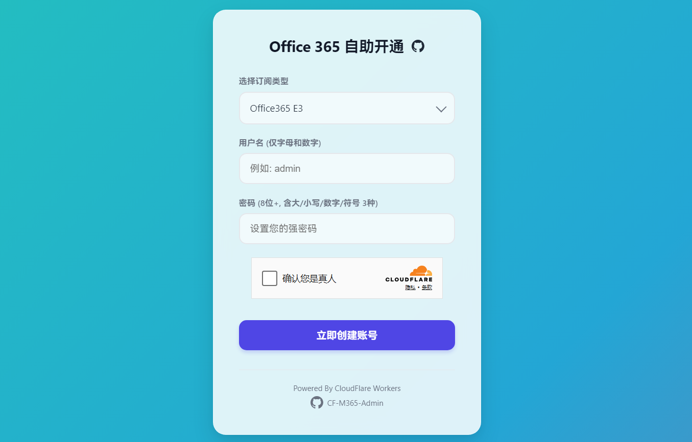
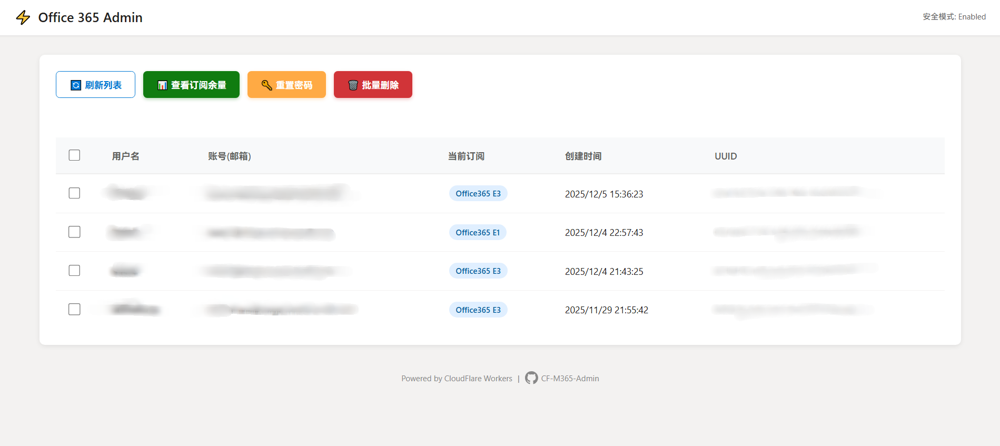

# CF-M365-Admin

基于 Cloudflare Workers 的 Microsoft 365 用户自助开通与轻量级管理面板。

这是一个无服务器（Serverless）的解决方案，用于快速部署 M365 账号分发系统。它包含一个面向用户的自助注册页面，以及一个面向管理员的简易后台，支持用户管理、订阅查询和安全控制。

## 📸 效果展示 (Screenshots)

以下是项目的运行效果示例：

### 示例 1：主界面 / 功能演示

*图注：这里是给用户展示的默认首页示例

### 示例 2：详细数据 / 结果展示

*图注：这里是管理端示例，用于管理已有用户

## ✨ 主要特性

* **自助注册 (前台)**
    * 集成 Cloudflare Turnstile 人机验证。
    * 支持多订阅选择（通过 SKU 映射隐藏真实 ID）。
    * 严格的密码策略校验（防止包含用户名、强制复杂度）。
    * 友好的中文错误提示。
* **管理后台 (后台 /admin)**
    * **用户列表**：支持按用户名、账号、创建时间进行正序/倒序排列。
    * **订阅展示**：直观显示每个用户当前的订阅类型。
    * **批量操作**：支持多选用户进行批量删除。
    * **密码重置**：支持批量生成随机密码或自定义密码。
    * **库存查询**：实时查询 Azure 租户内的许可证总数、已用数和剩余数。
* **安全机制**
    * **特权账号保护**：通过环境变量配置隐藏管理员账号，API 层面拦截对该账号的查询、删除和修改操作。
    * **防爆破**：集成 Turnstile。
    * **调试模式**：可开关的详细日志记录。

## 🛠️ 部署前提

1.  **Cloudflare 账号**：用于部署 Workers 和配置 KV/变量。
2.  **Microsoft 365 全局管理员权限**：用于注册 Azure AD 应用。
3.  **Azure AD 应用 (App Registration)**：
    * 注册一个新应用。
    * 获取 `Client ID` (客户端 ID) 和 `Tenant ID` (租户 ID)。
    * 生成 `Client Secret` (客户端密钥)。
    * **API 权限 (必须)**：
        * 类型：**Application (应用程序权限)**
        * 权限：`User.ReadWrite.All`, `Directory.ReadWrite.All`
        * **重要**：添加后必须点击“代表 xxx 授予管理员同意 (Grant admin consent)”。

## ⚙️ 环境变量配置

在 Cloudflare Workers 后台 -> Settings -> Variables 中配置以下变量：

| 变量名 | 说明 | 示例 / 备注 |
| :--- | :--- | :--- |
| `AZURE_TENANT_ID` | Azure 租户 ID | `xxxxxxxx-xxxx-xxxx-xxxx-xxxxxxxxxxxx` |
| `AZURE_CLIENT_ID` | Azure 应用 ID | `xxxxxxxx-xxxx-xxxx-xxxx-xxxxxxxxxxxx` |
| `AZURE_CLIENT_SECRET` | Azure 应用密钥 | `Value 而不是 Secret ID` |
| `CF_TURNSTILE_SECRET` | CF Turnstile 密钥 | 后端验证用 Secret Key |
| `TURNSTILE_SITE_KEY` | CF Turnstile 站点 ID | 前端显示用 Site Key |
| `DEFAULT_DOMAIN` | 默认域名后缀 | `example.onmicrosoft.com` (不带 @) |
| `ADMIN_TOKEN` | 后台访问密码 | `MySuperSecretToken123` |
| `SKU_MAP` | 订阅映射表 (填获取的JSON，获取方式和注意事项在下方！务必仔细阅读！) | `{"E5开发版":"你的SKU_ID_1", "A1学生版":"你的SKU_ID_2"}` |
| `HIDDEN_USER` | **(可选)** 隐藏管理员账号 | `admin@example.onmicrosoft.com` (完全匹配，防删除) |
| `ENABLE_DEBUG` | **(可选)** 调试模式 | 填 `true` 开启后端日志，生产环境建议留空 |

### 关于 SKU_MAP 的获取
两种获取方式（都需要参考下方的json进行自行填写）

json格式：`{"E5开发版":"你的SKU_ID_1", "A1学生版":"你的SKU_ID_2"}`

第一种方式：部署前，你可以先随便填一个 JSON，访问 `/admin?token=你的Token`，点击“查询订阅用量”按钮，即可获取你租户下所有真实的 SKU ID。

第二种方式：部署并设置好变量后，在浏览器访问： https://你的worker域名.workers.dev/admin/api/licenses?token=mySecret123 (把 mySecret123 换成你刚才设置的 ADMIN_TOKEN)
页面会返回一段 JSON（**不要直接填写这个json到环境变量，要用指定格式的json！**）。找到 skuPartNumber 是 DEVELOPERPACK_E5 或者 ENTERPRISEPACK (即 E3) 的那一项。

### **请务必注意，所有变量的变量类型都必须使用Text或Secret！包括SKU_MAP也是！不要用JSON变量类型！**

## 🚀 快速开始

1.  复制 `worker.js` 的完整代码到 Cloudflare Workers 编辑器。
2.  填入上述环境变量。
3.  点击 **Deploy**。

## 📖 使用指南

### 用户端
* 访问 `https://你的worker域名.workers.dev`
* 用户选择订阅、输入用户名密码即可创建。

### 管理端
* 访问 `https://你的worker域名.workers.dev/admin?token=你的ADMIN_TOKEN`
* **功能**：
    * **刷新列表**：加载最新用户数据（支持点击表头排序）。
    * **查询订阅用量**：弹窗显示当前许可证余量。
    * **修改/重置密码**：选中用户后，可批量重置。
    * **批量删除**：慎用！删除后不可恢复（`HIDDEN_USER` 设定的账号除外）。

## ⚠️ 免责声明

本项目仅供学习和内部管理使用。
* 请勿用于非法分发 Microsoft 账号。
* 作者不对因配置错误导致的数据丢失或账号被封禁承担责任。
* 涉及删除操作，请务必谨慎。

---
**License**: MIT
